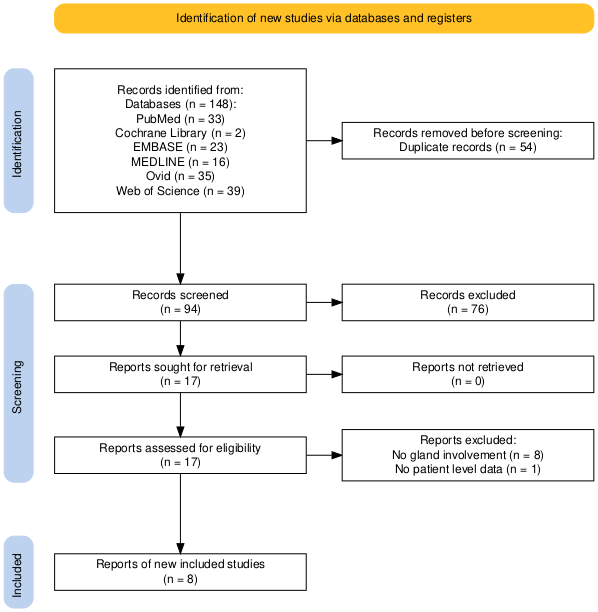

<!-- Header -->

  

<!-- Body of Poster -->
<!-- Start main 3-column layout -->

  <!-- Title box spanning first two columns -->
  

  
  # Uncommon Sites of Hepatocellular Carcinoma Metastasis: A Systematic Review of Salivary Gland Involvement
  
   <u>A.O. Morada</u> 1, C.K. Chen 1, C. Akateh 2, M.R. Marvin 2, A Kotru 2  
  1 Geisinger Northeast General Surgery Residency at Geisinger Wyoming Valley
  2 Liver and Kidney Transplant Surgery at Geisinger Medical Center
  
  <!-- End title box -->
  

  
  <!--- Placeholder for the third column --->
  

    <!--- Abstract ID & Logo --->
    

      
Abstract ID: #ILTS2025_1.04_4471

      

      <!--- End Abstract ID & Logo --->
    

  <!--- End placeholder for third column --->
  

<!-- Start intro/background -->

## INTRODUCTION / BACKGROUND
Hepatocellular carcinoma (HCC) is a leading cause of cancer-related mortality. While liver transplantation offers curative potential, recurrence occurs in up to 20% of recipients, typically within two years and often involving the lungs, bone, or lymph nodes. Metastasis to the salivary glands—especially the parotid—is exceedingly rare and may mimic benign tumors, delaying diagnosis. Diagnostic tools like FNAB are often inconclusive, and surveillance strategies rarely include the head and neck. This systematic review synthesizes all known cases of salivary gland metastasis from HCC and presents the first reported case in a liver transplant recipient.

<!-- End intro/background -->

<!-- Start results --> 

 ## RESULTS

 

  
Figure 1. PRISMA Diagram

  

    

    
Findings:

    <li>Total studies included: 9 (1991–2025)</li>
    <li>All patients were male; median age: 64 (range: 36–82)</li>
    <li>Most common gland involved: Parotid (8/9 cases)</li>
    <li>Most common symptom: Nontender swelling or mass (6/9)</li>
    <li>Median time to metastasis (metachronous cases): 2.5 years</li>
    <li>FNAB was diagnostic in only 2 of 8 cases</li>
    <li>Surgical resection performed in 6 of 9 cases</li>
    <li>Median survival: 6 months; 1-year survival: 33%</li>
    

  

Table 1. Summary of Cases
| Author          | Gland        | Metastasis Timing        | Symptoms           | Surgical Treatment            | Outcome            |
|----------------|--------------|---------------------------|--------------------|-------------------------------|--------------------|
| Morada (2025)  | Parotid      | Metachronous (2.5 Years)  | Tender swelling    | Parotidectomy                 | 13 mo (mortality)  |
| Deng (2021)    | Submandibular| Metachronous (8 Years)    | Tender swelling    | Resection + Flap              | 6 mo (mortality)   |
| Aiyer (2019)   | Parotid      | Synchronous               | Nontender mass     | None                          | Not Reported       |
| Elzouki (2014) | Parotid      | Synchronous               | Tender swelling    | None                          | 2 mo (mortality)   |
| Yu (2013)      | Parotid      | Metachronous (0.66 Years) | Nontender swelling | Parotidectomy                 | 12 mo (survival)   |
| Zhang (2017)   | Parotid      | Synchronous               | Nontender mass     | Parotidectomy                 | 10 mo (survival)   |
| Zeng (2012)    | Parotid      | Synchronous               | Nontender mass     | Superficial Parotidectomy     | 24 mo (survival)   |
| Dardick (1991) | Parotid      | Synchronous               | Nontender swelling | Parotidectomy                 | 8 mo (mortality)   |
| Yamashita (1991)| Parotid     | Synchronous               | Tender mass        | Parotidectomy                 | 10 mo (survival)   |

<!-- End results --> 
  

<!-- Start objectives/aims -->

<h2> OBJECTIVES / AIMS </h2>
  <ul>
    <li>Review published cases of HCC metastasis to salivary glands.</li>
    <li>Describe clinical presentation, diagnostics, treatment, and outcomes.</li>
    <li>Highlight the first reported case of parotid metastasis following liver transplantation.</li>
  </ul>

<!-- Start methods -->

## METHODS
Systematic review conducted in Nov 2024 per PRISMA guidelines. Databases: PubMed, EMBASE, MEDLINE, Cochrane, Web of Science, and Ovid. Inclusion: human studies reporting HCC metastasis to salivary glands. Two independent reviewers screened abstracts and full texts; discrepancies were resolved by consensus. Data extracted included demographics, presentation, diagnostics, treatment, and outcomes. Risk of bias assessed qualitatively due to case-based design.

<!-- End methods -->

<!-- Start conclusion -->

## CONCLUSIONS
Among the 9 cases reviewed, parotid gland metastasis was predominant, often presenting as painless swelling. FNAB frequently yielded inconclusive results, delaying diagnosis. Metachronous metastases showed slightly longer survival, especially when treated with surgery.

<!-- End conclusion -->

<!-- Start acknowledgement -->

## ACKNOWLEDGEMENT 
We thank the Department of Transplant Surgery at Geisinger Medical Center for clinical guidance and support. We also acknowledge the contributions of the abstract review team and our collaborators in data extraction and literature review.

<!-- End acknowledgement -->

<!-- Start ref --> 

<h2> REFERENCES </h2>
  <ol>
    <li>Deng Y, Chen Y, Zhang H, et al. Submandibular gland metastasis from hepatocellular carcinoma: A rare case report and literature review. Int J Oral Maxillofac Surg. 2021;50(9):1202–1206.</li>
    <li>Aiyer R, Enam S, Khan A, et al. Hepatocellular carcinoma presenting as a parotid mass: a diagnostic challenge. Head Neck Pathol. 2019;13(1):104–108.</li>
    <li>Elzouki A-N, Scolapio JS, Mujtaba M. Hepatocellular carcinoma metastasis to the parotid gland: a rare presentation. Am J Gastroenterol. 2014;109(10):1607–1608.</li>
    <li>Yu S, Ho C, Hsu C, et al. Parotid gland metastasis in hepatocellular carcinoma. J Chin Med Assoc. 2013;76(7):404–406.</li>
    <li>Zhang Y, Li X, Wang Y, et al. Parotid gland metastasis of hepatocellular carcinoma: a case report. Oncol Lett. 2017;14(6):7653–7656.</li>
    <li>Zeng J, Liu H, Peng Z, et al. Metastasis of hepatocellular carcinoma to the parotid gland: case report and review of the literature. Oncol Lett. 2012;4(3):607–610.</li>
    <li>Dardick I, El-Rouby NM, Thomas MJ, et al. Hepatocellular carcinoma metastatic to the parotid gland. J Otolaryngol. 1991;20(6):441–444.</li>
    <li>Yamashita S, Tsuda M, Inoue H, et al. Hepatocellular carcinoma metastatic to the parotid gland: a case report. Acta Otolaryngol Suppl. 1991;487:167–170.</li>
    <li>Haddaway NR, Page MJ, Pritchard CC, McGuinness LA. PRISMA2020: An R package and Shiny app for producing PRISMA 2020-compliant flow diagrams, with interactivity for optimised digital transparency and Open Synthesis. Campbell Syst Rev. 2022;18:e1230. doi:10.1002/cl2.1230</li>
  </ol>

<!-- Start contact --> 

## CONTACT INFORMATION
   [_anthony.omorada@gmail.com_](mailto:<insert-email>@jhu.edu) 
   [_@anthonyomorada (Github)_](https://github.com/<insert-handle>) 
   [_@anthonyomorada (Twitter)_](https://twitter.com/anthonyomorada) 
   [_ORCID: 0000-0002-0428-6558_](https://orcid.org/0000-0002-0428-6558)

QR Code to Github Repository and Data

<!-- End CONTACT -->

<!--- End of Poster Body --->

<!-- Footer -->

